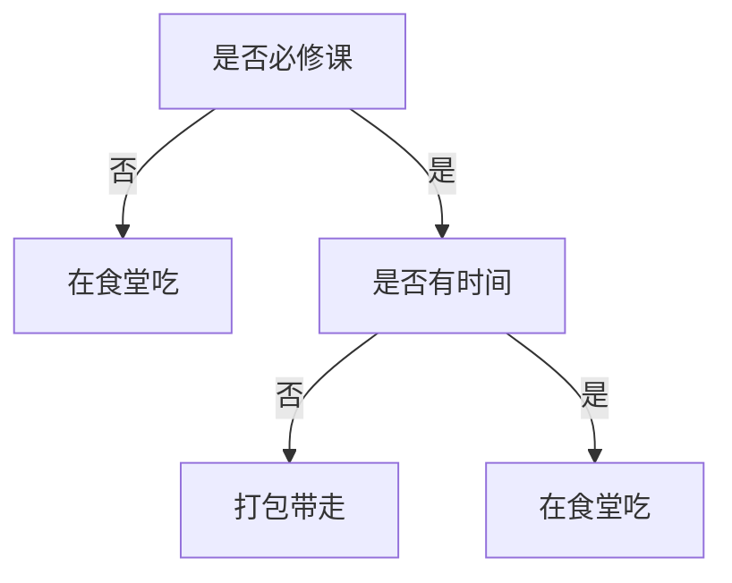
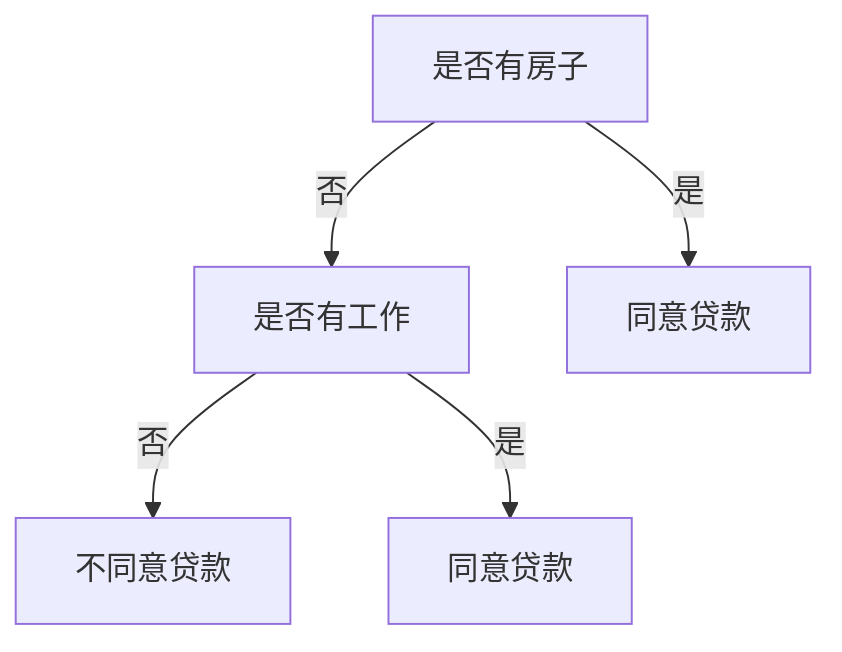

决策树是一种非参数的有监督的学习方法，可以用来分类和回归，即分类决策树，回归决策树。分类决策树，可以看成是if--then规则的集合，树的每一个中间节点就是一个特征，用来if--then规则的判断，树的每一个叶子节点就是最终的分类结果。

基本思想：决策树就是一个，递归地选择最优特征，并根据该特征对训练数据集进行划分，使得对各个子数据集有一个最好的分类，的过程。训练数据集的划分过程就是决策树的构建过程。在开始时，所有训练数据都在根节点，然后选择一个最优特征，根据这一特征将训练数据集划分成不同的子数据集到不同的子节点中，最后递归地对各个子节点继续划分数据集，直到每个叶子节点都被分为一类。

------


<!--more-->


## 决策树的特征选择

在进行特征选择时，我们总希望选取的特征能够最大程度地降低数据集的不确定性。为此，我们需要引进信息论中常用的熵的概念。

#### 信息熵

在大三时学过信息论基础，其中就提到了信息熵的定义。在信息论中，信息熵表示了随机变量的不确定性度量。设$X$ 是一个离散随机变量，其概率分布为:
$$
P(X=x_i)=p_i\tag{1}\quad\forall i=1,2,\cdots\,\lvert X\rvert
$$
那么随机变量$X$ 的熵定义为：
$$
H(X)=-\sum\limits_{i=1}^{\lvert X\rvert}p_i\log{p_i}\tag{2}
$$
当随机变量$X$ 只有两个取值$0, 1$，即$\lvert X\rvert=2$时，此时$X$ 的分布为:
$$
P(X=0)=p,P(X=1)=1-p\tag{3}
$$
那么此时公式(2)可以写为：
$$
H(X)=-p\log{p}-(1-p)\log{(1-p)}\tag{4}
$$
公式(4)的图像如下所示：


由图1可以看出，当$p=0,1$时，此时随机变量$X$的取值时确定性的。当$p=0.5$时，此时$X$取值的不确定性最大，熵最大。

--------

#### 条件熵

条件熵表示的是在已知随机变量$X$的情况下，随机变量$Y$的不确定性，其定义为：
$$
H(Y\mid X)=\sum\limits_{i=1}^{\lvert X\rvert}P(X=x_i)H(Y\mid X=x_i)\tag{5}
$$
一般来说，公式(4)和(5)中的概率$P(X=x_i)$都是由训练样例得到的估计值，此时，我们把熵和条件熵又称为经验熵和经验条件熵。一般地，当$P(X=x_i)=p_i=0$时，我们假设$p_i\log{p_i}=0$.

---------------------

#### 信息增益

信息增益指的是信息熵与条件熵之间的互信息。根据公式(2)和(5), 信息增益可以表示为：
$$
Gain(Y,X)=H(Y)-H(Y\mid X)\tag{6}
$$
由公式(6)可以看出，信息增益指的是知道$X$后，对$Y$的取值不确定性的减少程度。

-----

我们可以将信息熵的概念应用到决策树问题中的特征选择问题上。假设训练数据集为$\mathcal D$, 其中有$N$个训练样本，$M$ 个特征，$L$个标签类别($\mathcal D_1,\mathcal D_2,\cdots,\mathcal D_N$)，那么我们有$\sum\nolimits_{l=1}^{L}\lvert\mathcal D_{l}\rvert=N$。假定特征$m$有$m_K$个特征取值，根据特征$m$ 的取值我们可以将数据集$D$划分为$m_K$个子数据集$\mathcal D_1^m,\mathcal D_2^m,\cdots D_{m_K}^m$。我们将子数据集$\mathcal D_k^m$中属于类别$l$的数据集合记为$\mathcal D_{kl}^m$。此时公式(2), (5), (6)可以写为：
$$
H(\mathcal D)=-\sum\limits_{l=1}^{L}\frac{\lvert\mathcal D_l\rvert}{\lvert\mathcal D\rvert}\log{\frac{\lvert\mathcal D_l\rvert}{\lvert\mathcal D\rvert}}\tag{7}
$$

$$
H(\mathcal D\mid m)=-\sum\limits_{i=1}^{m_K}\frac{\lvert\mathcal D_{i}^m\rvert}{\lvert\mathcal D\rvert}H(\mathcal D_{i}^m)=-\sum\limits_{i=1}^{m_K}\frac{\lvert\mathcal D_{i}^m\rvert}{\lvert\mathcal D\rvert}\sum\limits_{l=1}^{L}\frac{\lvert\mathcal D_{il}^m\rvert}{\lvert\mathcal D_{i}^m\rvert}\log{\frac{\lvert\mathcal D_{il}^m\rvert}{\lvert\mathcal D_{i}^m\rvert}}\tag{8}
$$

$$
Gain(\mathcal D,m)=H(\mathcal D)-H(\mathcal D\mid m)\tag{9}
$$

--------

一般来说，信息增益$Gain(\mathcal D,m)$越大，意味着使用特征$m$对数据集$\mathcal D$进行分类后，数据集的不确定性越小。因此，我们可以利用信息增益来对决策树进行特征选择。那么特征选择的表达式即为：
$$
m^\star=\arg\max\limits_{m}{\quad Gain(\mathcal D,m)}\tag{10}
$$

由于$H(\mathcal D)$相同，特征选择的表达式也可以由条件熵来表示：
$$
m^\star=\arg\min\limits_{m}{\quad H(\mathcal D\mid m)}\tag{11}
$$

----------------------

#### 一个例子

这里我们以小明吃早餐是否打包带走为例来说说特征选择与决策树的生成。我有个同学叫小明，我们记录了他每天早餐是否打包带走与课程类型( $course$ )、时间( $time$ )是否充裕、以及天气( $weather$ )好坏的关系。如下表所示：

| 是否必修课 | 是否有时间 | 是否好天气 | 打包带走 |
| :--------: | :--------: | :--------: | :------: |
|     0      |     0      |     0      |    0     |
|     0      |     0      |     1      |    0     |
|     0      |     1      |     0      |    0     |
|     0      |     1      |     1      |    0     |
|     1      |     0      |     0      |    1     |
|     1      |     0      |     1      |    1     |
|     1      |     1      |     0      |    0     |

其中，$0,1$分别代表是和不是。我们的目的是估计当是必修课($course=1$)，有时间($time=1$)，好天气($weather=1$)的情况下，小明是否打包带走？


首先，我们求关于其三个属性的条件熵，分别为：
$$
\begin{aligned}
H(\mathcal D\mid course)&=-\frac{4}{7}*0-\frac{3}{7}(\frac{2}{3}\log{\frac{2}{3}}+\frac{1}{3}\log{\frac{1}{3}})=0.3936\\
H(\mathcal D\mid time)&=-\frac{4}{7}(\frac{1}{2}\log{\frac{1}{2}}+\frac{1}{2}\log{\frac{1}{2}})-\frac{3}{7}*0=0.5714\\
H(\mathcal D\mid weather)&=-\frac{4}{7}(\frac{1}{4}\log{\frac{1}{4}}+\frac{3}{4}\log{\frac{3}{4}})-\frac{3}{7}*(\frac{1}{3}\log{\frac{1}{3}}+\frac{2}{3}\log{\frac{2}{3}})=0.8571\\
\end{aligned}
$$
因此，我们选择是否是必修课($course$ )作为我们的第一个分类特征。我们发现，当$course=0$，不管是否有时间，天气咋样，小明都选择在食堂吃完再去上课，即此时归为一类；下面我们考虑当$course=1$时，如何进行特征选择？ 当$course=1$时，子数据集记为$\mathcal D^1_1$包含第$5,6,7$三个训练样例。这时我们计算条件熵：
$$
\begin{aligned}
H(\mathcal D_1^1\mid time)&=-\frac{2}{3}*0-\frac{1}{3}*0=0\\
H(\mathcal D_1^1\mid weather)&=-\frac{2}{3}*(\frac{1}{2}\log{\frac{1}{2}}+\frac{1}{2}\log{\frac{1}{2}})-\frac{1}{3}*0=0.6667
\end{aligned}
$$
我们发现$H(\mathcal D_1^1\mid time)=0$，说明在已知$time$的情况下，数据集$D_1^1$时完全确定的，也就是说，我们只需要$weather$和$time$ 两个特征属性，就可以得到正确的标签，不需要考虑天气这个属性。此时的决策树如下：



从我们得到的决策树可以看出，当课程不是必修课时，小明总是慢悠悠地在食堂吃完再去上课，不在乎迟不迟到。只有当课程是必修课，且已经快要上课时，小明才会选择打包带走。

--------------

## 决策树的生成

在上面小明的例子中，我们已经基本描述了如何选择特征来生成决策树: 选择使得条件熵最大的特征，将数据集划分为子数据集，递归地对子数据集进行相同操作，直至子数据集都属于同一类。当所有特征都无法使得子数据集的样例属于同一类时，我们采用多数表决来使其归为一类。

上述提到的决策树生成过程就是最基本的ID3算法。但是，我们从公式(8)可以看出，经过特征选择后划分的子数据集中样本数量对特征选择影响很大。还是以小明吃早餐为例，如果上述7个样例是在1-7号获得的。假定我们考虑这个日期特征，那么如果选择日期为我们选择的特征，那么将划分为7个子数据集，每个子数据集只有一个样例，此时的不确定性为0。那么此时根据公式(8)，可以得到的条件熵也为0, 为此日期就会作为分类特征，且为唯一的特征。也就是说，根据日期可以直接确定是否打包带走。显然，这不是我们想要的结果。原因在于样例不够多，可能需要收集每个月1-7号的样例，这样才合理。

--------

另一个方法就是使用其它规则来进行特征选择，比如说**C4.5中的信息增益率**，其定义如下：
$$
Gain\_ratio(\mathcal D\mid m)=\frac{Gain(\mathcal D\mid m)}{H(m;\mathcal D)}\tag{12}
$$
其中，$H(m;\mathcal D)$可以看成是数据集$\mathcal D$在$m$特征划分下，每一个子数据集的样例数分布的不确定性：
$$
H(m;\mathcal D)=-\sum\limits_{i=1}^{m_K}\frac{\lvert\mathcal D_{i}^m\rvert}{\lvert\mathcal D\rvert}\log{\frac{\lvert\mathcal D_{i}^m\rvert}{\lvert\mathcal D\rvert}}\tag{13}
$$
公式(13)表明，当每个子数据集$\mathcal D_i^m$中的样例数差不多时，$H(m;\mathcal D)$最大，此时对应的信息增益率变小$Gain\_ratio(\mathcal D\mid m)$变小。以日期特征为例，每个子数据集只有一个样例，此时$H(m;\mathcal D)$取得最大值，信息增益率变小，为此，我们可能不会选择该特征进行分类。

---------------

除此之外，还有一个比较常用的特征选择的规则，即**CART算法的基尼指数**：
$$
Gini(\mathcal D)=\sum\limits_{l=1}^{L}{p_l(1-p_l)}\tag{14}
$$
其中，$p_l$是类别$l$所占样本数的概率。类似公式(8)，对每个类别进行加权，可以得到特征$m$条件基尼指数:
$$
Gini(\mathcal D\mid m)=-\sum\limits_{i=1}^{m_K}\frac{\lvert\mathcal D_{i}^m\rvert}{\lvert\mathcal D\rvert}Gini(\mathcal D_{i}^m)\tag{15}
$$

----------------

ID3, C4.5以及CART的算法流程大致相同，只是在进行特征选择的时候，分别采用了规则(11), (13) 和(15)。 本文以ID3算法为例进行决策树算法实践。由于算法较为简单，注释也比较详细，在此不予具体说明。算法中，我们以上面小明吃早餐例子和下面的统计机器学习的例子来作为具体实现。

下表由15个训练数据组成，有4个特征：{年龄：青年，中年，老年}；{是否有工作：有，否}；{是否有房子：有，否}；{信贷情况：一般，好，非常好}。输出为 {贷款：是，否}。

| 年龄 | 有工作 | 有房子 | 信贷情况 | 类别 |
| :--: | :----: | :----: | :------: | :--: |
| 青年 |   否   |   否   |   一般   |  否  |
| 青年 |   否   |   否   |    好    |  否  |
| 青年 |   有   |   否   |    好    |  有  |
| 青年 |   有   |   有   |   一般   |  有  |
| 青年 |   否   |   否   |   一般   |  否  |
| 中年 |   否   |   否   |   一般   |  否  |
| 中年 |   否   |   否   |    好    |  否  |
| 中年 |   有   |   有   |    好    |  有  |
| 中年 |   否   |   有   |  非常好  |  有  |
| 中年 |   否   |   有   |  非常好  |  有  |
| 老年 |   否   |   有   |  非常好  |  有  |
| 老年 |   否   |   有   |    好    |  有  |
| 老年 |   有   |   否   |    好    |  有  |
| 老年 |   有   |   否   |  非常好  |  有  |
| 老年 |   否   |   否   |   一般   |  否  |

和计算小明吃早餐的例子一样，我们可以得到如下的决策树：



具体python源代码见附录，实验结果如下图2：


- 在小明吃早餐的例子中，生成的决策树为(用字典表示)：

  ```py
  {'0': {0: 'n', 1: {'1': {0: 'y', 1: 'n'}}}}
  ```

​       当我们输入测试样例{必修课: 是，是否有时间：是，是否好天气：是}时，根据上面的生成的决策树，我们预测小明不会选择打包带走。

- 在是否同意贷款的例子中，生成的决策树为(用字典表示):

  ```py
  {'2': {0: {'1': {0: 'n', 1: 'y'}}, 1: 'y'}}
  ```

​       当我们输入测试样例(年龄: 中年，是否有工作：是，是否有房子：是，信贷情况：一般)时，根据上面生成的决策树，我们预测银行会同意贷款。


## 决策树的剪枝

剪枝的目的就是为了防止过拟合。在生成决策树的过程中，为了尽量正确对训练样本进行分类，会导致决策树分支过多，决策树变得复杂。生成的决策树可能会把训练集中特征与输出的特有关系当成所有数据的一般关系，这样导致决策树的范化能力较差。为了避免过拟合，一般我们可以降低模型的复杂度，见【图解例说机器学习】模型的选择：偏差与方差。对于决策树来说，降低模型的复杂度意味着减少树的分支，即剪枝。


决策树的剪枝可能分为预剪枝和后剪枝。顾名思义，预剪枝指的是在生成决策树的过程中，对选定的特征进行划分数据集的时候进行预先估计，估计按照此特征进行划分后是否能提高对验证集的分类能力，即泛化能力。而后剪枝指的是在决策树生成后，自底向上地对每一个父节点进行判断，若删除该父节点对应的子节点使其变成叶子节点后，能够提高对验证集的分类能力，则对该父节点进行剪枝。

具体用于剪枝的算法有很多，我们只介绍常见的两种：错误率降低剪枝 和 损失函数降低剪枝：

- 错误率降低剪枝: 对比剪枝前后对验证集的分类错误率，选择使得错误率降低的操作：剪枝或者不剪枝

- 损失函数降低剪枝：对比剪枝前后，选择使得损失函数降低的操作：剪枝或者不剪枝
  其中，损失函数定义为：
  $$
  E=H(\mathcal D\mid m)+\alpha m_K\tag{16}
  $$
  公式(16)中的第一项即公式(8)，表示的是选择特征$m$进行训练数据集划分后的不确定性；$m_K$是划分后的子数据集个数，在一定程度上可以代表决策树的复杂度；$\alpha$是权重因子，较大的$\alpha$生成较高复杂度的决策树，较小的$\alpha$生成较低复杂度的决策树。当$\alpha=0$时，相当于不考虑剪枝，即只考虑模型与训练数据集的误差，不考虑模型的复杂程度。

篇幅有限，这里我们只介绍了剪枝的思想，就不在算法实现剪枝操作。

---------

## 一些说明

#### 连续值与缺失值

- 连续值处理
  上述我们都是以离散特征为例介绍决策树，实际生活中，我们肯定会遇到特征取连续值的情况。在已经介绍离散特征的前提下，一个自然而然的想法就是将连续特征离散化。其**基本思想**为：将特征的取值范围划分为$n$个相邻的区间，并以每个小区间的中间值作为候选的划分点，也就是相当于是离散特征的取值。这样我们就可以利用前面的决策树生成算法来选择候选划分点，并进行数据集划分。
- 缺失值处理
  在实际中，有些样例的某些特征的值是缺失的。在这种情况下，一种简单的方法就是舍弃这个样例。但是在样例较少的情况下，这样做显然没有利用好已知信息(一个样例的部分特征)。其基本思想为：当一个样例的某个特征的值是缺失时，我们在以特征进行划分时，我们以概率将这个样本划分到不同的子数据集中。详细步骤请参考C4.5算法。

--------

#### 优缺点

在[skl-learn的决策树](https://scikit-learn.org/stable/modules/tree.html#tree)中，一开始就介绍了其优缺点。主要优缺点具体如下：

- 优点
  - 决策树可以通过图像显示出来，逻辑清晰，简单直观
  - 基本不需要对数据进行预处理：归一化，去除空值样本
  - 适用于多变量输出问题
  - 由于决策树是一组if-then规则的集合，模型具有很好的解释型
- 缺点
  - 容易出现过拟合，但是可以通过剪枝来处理
  - 对训练集比较敏感。当训练数据改变一点点时，决策树可能完全不同。这时可以通过后续文章会介绍的集成学习来处理。
  - 生成最优的决策树是一个NP完全问题。一般采用的都是贪婪算法来寻求局部最优解，贪婪体现在每次选择是当前划分最优的特征上。同样地，我们可以通过集成学习来处理。
  - 有些比较复杂的关系，决策树比较难以学习，比如异或。此时考虑将特征空间进行变换，即用新的特征代替现有特征。

-----------

## 附录



```python
# -*- coding: utf-8 -*-
# @Time : 2020/4/22 23:09
# @Author : tengweitw

import numpy as np
import matplotlib.pyplot as plt

# Set the format of labels
def LabelFormat(plt):
    ax = plt.gca()
    plt.tick_params(labelsize=14)
    labels = ax.get_xticklabels() + ax.get_yticklabels()
    [label.set_fontname('Times New Roman') for label in labels]
    font = {'family': 'Times New Roman',
            'weight': 'normal',
            'size': 16,
            }
    return font

p = np.linspace(0.001, 0.999, 100)
H_X = -p * np.log2(p) - (1 - p) * np.log2(1 - p)

plt.figure()
plt.plot(p, H_X, 'b-')
# Set the labels
font = LabelFormat(plt)
plt.xlabel('$p$', font)
plt.ylabel('$H(X)$', font)
plt.grid()
plt.show()

```





```python
# -*- coding: utf-8 -*-
# @Time : 2020/4/27 14:24
# @Author : tengweitw


import numpy as np
from collections import Counter


def loadDataSet_xiaoming():
    """
    @ return training data
    """
    train_data = [[0, 0, 0],
                  [0, 0, 1],
                  [0, 1, 0],
                  [0, 1, 1],
                  [1, 0, 0],
                  [1, 0, 1],
                  [1, 1, 0]]
    num_value_feature = [2, 2, 2]
    train_label = ['n', 'n', 'n', 'n', 'y', 'y', 'n']

    return train_data, train_label, num_value_feature

def loadDataSet_loan():
    """
    @ return training data
    """
    train_data =[ [0, 0, 0, 0],
                  [0, 0, 0, 1],
                  [0, 1, 0, 1],
                  [0, 1, 1, 0],
                  [0, 0, 0, 0],
                  [1, 0, 0, 0],
                  [1, 0, 0, 1],
                  [1, 1, 1, 1],
                  [1, 0, 1, 2],
                  [1, 0, 1, 2],
                  [2, 0, 1, 2],
                  [2, 0, 1, 1],
                  [2, 1, 0, 1],
                  [2, 1, 0, 2],
                  [2, 0, 0, 0]
    ]
    num_value_feature = [3, 2, 2, 3]
    train_label = ['n', 'n', 'y', 'y', 'n', 'n', 'n', 'y', 'y', 'y', 'y', 'y', 'y', 'y', 'n']

    return train_data, train_label, num_value_feature

def Cal_entropy(train_data, train_label):
    """
    Calculate entropy of dataset
    """
    len_train_data = len(train_data)
    # counter the number of each class
    dict_classes = Counter(train_label)
    prob = []
    Entropy = 0
    # For each class, compute its possibility
    for i in dict_classes:
        prob.append(dict_classes[i] / len_train_data)

    for i in range(len(prob)):
        Entropy = Entropy - (prob[i] * np.log2(prob[i]))

    return Entropy


def Split_dataSets(train_data, train_label, selected_feature, value_feature):
    """
    Split datasets according to the selected_feature
    """
    new_dataSet = []
    new_dataLabel = []
    # for each training instance
    for i in range(len(train_label)):
        if train_data[i][int(selected_feature)] == value_feature:
            new_dataSet.append(train_data[i])
            new_dataLabel.append(train_label[i])

    return new_dataSet, new_dataLabel


def Select_feature(train_data, train_label, num_value_feature):
    # Select the feature that minimize the conditional entropy

    num_feature = np.size(train_data, axis=1)

    Entropy = []
    for i in range(num_feature):
        selected_feature_temp = i
        Entropy_temp = []
        Entropy_temp2 = 0
        cnt_temp = []
        # for each sub dataset to compute the entropy
        for j in range(num_value_feature[i]):
            value_feature = j
            new_dataSet, new_dataLabel = Split_dataSets(train_data, train_label, selected_feature_temp, value_feature)
            cnt_temp.append(len(new_dataLabel))
            Entropy_temp.append(Cal_entropy(new_dataSet, new_dataLabel))

        # Compute the desired entropy by weights
        for k in range(len(cnt_temp)):
            Entropy_temp2 += cnt_temp[k] * Entropy_temp[k] / sum(cnt_temp)
        Entropy.append(Entropy_temp2)
    # find the minimum conditional entropy
    selected_feature = Entropy.index(min(Entropy))
    return str(selected_feature)


def Decision_tree(train_data, train_label, num_value_feature):
    # Create decision tree

    dict_classes = Counter(train_label)
    temp = sorted(dict_classes.items(), key=lambda item: item[1], reverse=True)
    # all trainning data in the set are grouped into the same class
    if len(dict_classes) == 1:
        return train_label[0]
    # We are still able to classify the dataset into the same class
    # Thus, we resort to major ruler
    elif not train_data:
        # find the major class
        temp=sorted(dict_classes.items(), key=lambda item: item[1], reverse=True)
        return temp.keys()[0]
    # recursion
    else:
        selected_feature = Select_feature(train_data, train_label, num_value_feature)

        # Use a dict to save the nodes in the tree
        Tree = {selected_feature: {}}
        # selected_feature is a str, we use int to transform it.
        selected_feature_value = num_value_feature[int(selected_feature)]

        for i in range(selected_feature_value):
            selected_feature_temp = selected_feature
            value_feature = i
            new_dataSet, new_dataLabel = Split_dataSets(train_data, train_label, selected_feature_temp, value_feature)
            Tree[selected_feature][value_feature] = Decision_tree(new_dataSet, new_dataLabel, num_value_feature)
        return Tree


def classify(Tree, test_data):
    # To get the key and value
    Str = list(Tree.keys())[0] #key
    Dict = Tree[Str] #value: is also a dict, otherwise is a leaf node

    # Recursion
    for key in Dict.keys(): # to get each child node until the leaf node
        if test_data[int(Str)] == key:
            if type(Dict[key]).__name__ == 'dict': # is a leaf node (i.e., a dict type)
                classLabel = classify(Dict[key], test_data)
            else:
                classLabel = Dict[key]
    return classLabel

if __name__ == '__main__':

    print('----The first example: Xiao Ming eating breakfast----')
    train_data, train_label, num_value_feature = loadDataSet_xiaoming()
    Tree = Decision_tree(train_data, train_label, num_value_feature)
    print('The decision tree is',Tree)
    print('----Course=1, time=1, weather=1----')
    print('Does Xiao Ming take away his breakfast?', classify(Tree, [1, 1, 1]))
    print('\n')

    print('----The second example: Whether to approve a loan----')
    train_data, train_label, num_value_feature = loadDataSet_loan()
    Tree = Decision_tree(train_data, train_label, num_value_feature)
    print('The decision tree is',Tree)
    print('\n------age=1, work=1, house=1, reputation=0----')
    print('Does the bank approve the loan?',classify(Tree, [1,1,1,0]))
```




